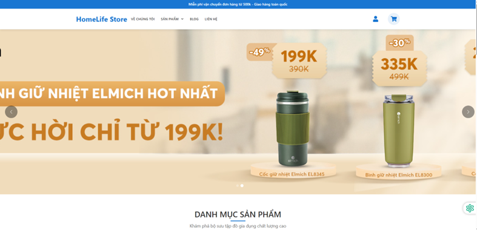
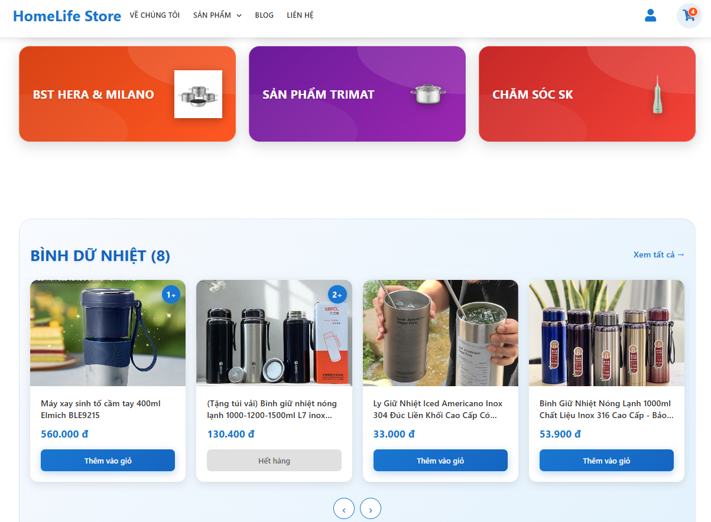
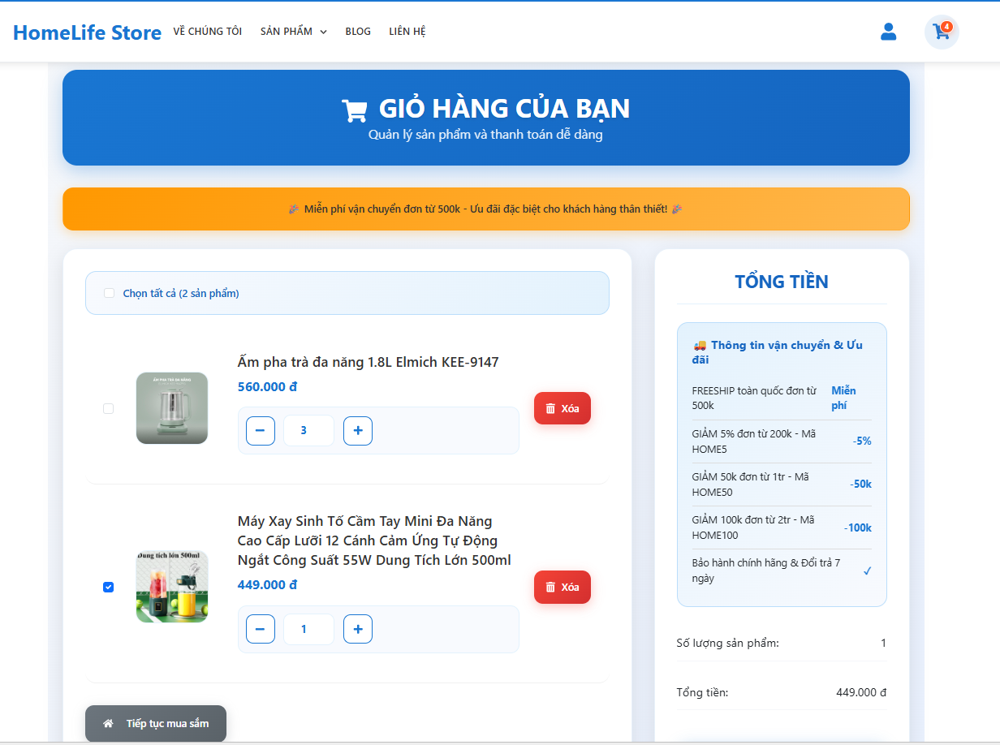
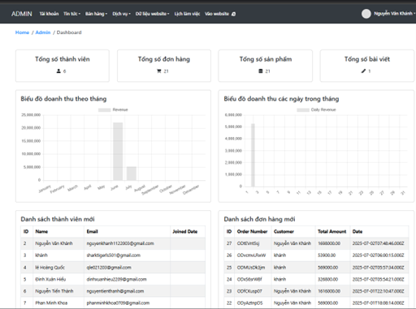
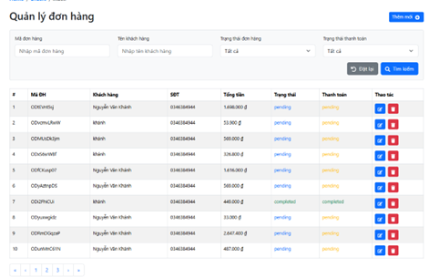
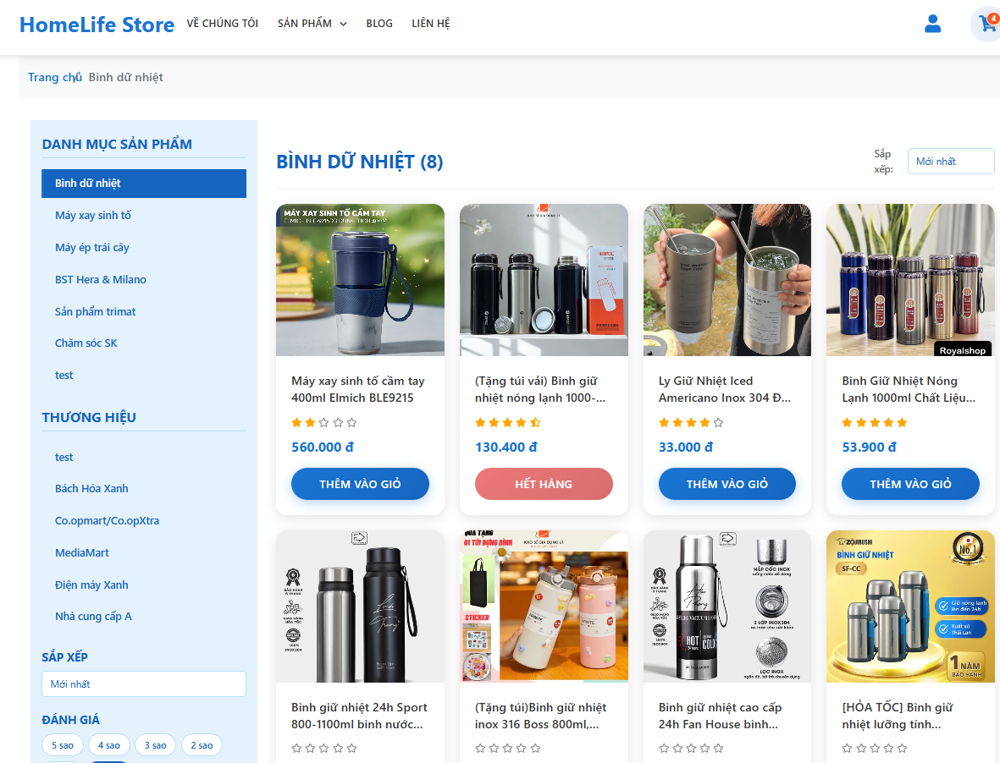

# 🛒 Website Bán Đồ Gia Dụng

Website mô phỏng bán hàng gia dụng đơn giản, sử dụng HTML, CSS, JavaScript và Node.js.

## 📸 Giao diện

## 🔧 Chức năng

- Hiển thị sản phẩm
- Responsive cho di động
- Navigation đơn giản

## 🛠 Công nghệ

- HTML5, CSS3
- JavaScript
- Node.js, Express.js (backend)

## 🌐 Link demo
[Truy cập link]([Truy cập website](https://drive.google.com/drive/folders/1ytsW1M4R71D0lFVcH457mtPfXRrFSabI?usp=sharing))

